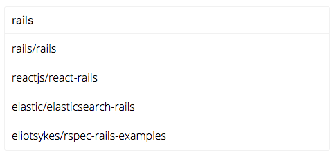

# React-Search-Box

An autocomplete search box built with and for [React](http://facebook.github.io/react/index.html).

## Demo & Examples

[**Demo**](https://ghoshnirmalya.github.io/react-search-box/)



Clone this repo then run:

```javascript
cd example
npm install
npm start
```

Then open [`localhost:3000`](http://localhost:3000) in a browser.

## Installation

The easiest way to use React-Search-Box is to install it from NPM and include it in your own React build process (using [Browserify](http://browserify.org), etc).

```javascript
npm install react-search-box --save
```

At this point you can import react-search-box and its styles in your application as follows:

```js
import Search from "react-search-box";
```

## Usage

React-Search-Box can also listen for changes with the `onChange` event property.

The 'data' property should be provided as an `Array`.
The `placeholder` property of each option should be set to either a string or a number.
The `searchKey` property of each option should be set to either a string or a number. It is the key that the search box will use for while iterating over your array of objects.

Have a look at the [`example/src/app.js`](https://github.com/ghoshnirmalya/react-search-box/blob/master/example/src/app.js) file for more details.

### Custom classNames

You can provide a custom `class` prop to the `<Search>` component, for custom styling.

# Contributing

All sorts of contributions are welcome.

# License

MIT Licensed. Copyright (c) Nirmalya Ghosh 2018.
